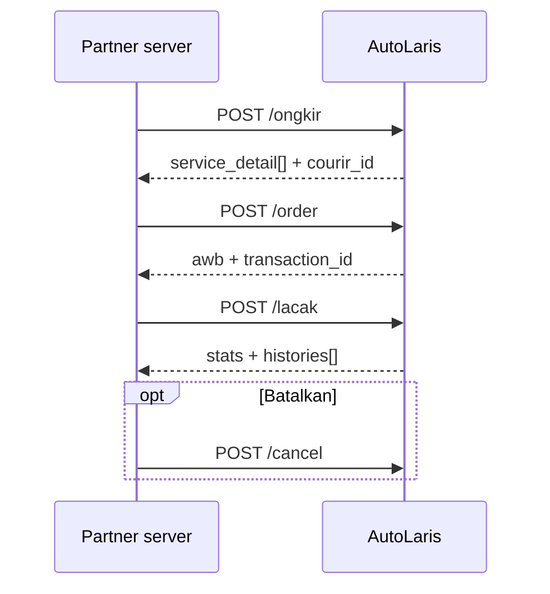

# AutoLaris H2H API

Dokumentasi integrasi AutoLaris untuk ongkir, pengiriman, tracking, payment gateway, dan order terpadu.

> Snapshot kontrak: koleksi Postman AutoLaris `latest`, diperiksa 2026-08-18. API dapat berubah tanpa versioned path; jalankan smoke test dengan credential development sebelum go-live.

## Mulai di sini

1. Minta API Key melalui [dashboard seller](https://seller.autolaris.com). Akses production membutuhkan whitelist maksimal 5 IP.
2. Simpan key hanya di server sebagai `AUTOLARIS_API_KEY`. Jangan kirim key ke browser atau commit ke repository.
3. Pilih panduan:

| Kebutuhan | Dokumen |
|---|---|
| Referensi 7 endpoint dan payload | [AutoLaris-H2H-API.md](./AutoLaris-H2H-API.md) |
| Payment, channel, callback, rekonsiliasi | [AutoLaris-Payment-Gateway-API.md](./AutoLaris-Payment-Gateway-API.md) |
| Copy-paste Astro, Next.js, Node.js, Cloudflare Workers, PHP | [INTEGRATION-GUIDE.md](./INTEGRATION-GUIDE.md) |
| Kontrak machine-readable | [openapi.json](./openapi.json) |

## Endpoint

Base URL: `https://api-h2h.autolaris.com`

| Service | Method | Path | Fungsi |
|---|---:|---|---|
| Cek Ongkir | `POST` | `/api/h2h/ongkir` | Daftar layanan, tarif, dan `courir_id` |
| Create Resi | `POST` | `/api/h2h/order` | Membuat resi reguler atau COD |
| Tracking | `POST` | `/api/h2h/lacak` | Status dan histori berdasarkan `awb` |
| Cancel Resi | `POST` | `/api/h2h/cancel` | Membatalkan resi berdasarkan `transaction_id` |
| Create Payment | `POST` | `/api/h2h/create_payment` | Membuat tagihan VA, QRIS, atau e-wallet |
| List Payment Channel | `GET` | `/api/h2h/list_payment` | Channel aktif dan biaya admin akun |
| Create Order | `POST` | `/api/h2h/submit` | Membuat order, pengiriman, dan payment sekaligus |

Semua endpoint memakai:

```http
Authorization: Bearer <API_KEY>
Content-Type: application/json
```

`Content-Type` tidak diperlukan untuk `GET /api/h2h/list_payment`.

## Quick start

Cek channel yang aktif untuk akun:

```bash
curl --fail-with-body \
  -H "Authorization: Bearer $AUTOLARIS_API_KEY" \
  "https://api-h2h.autolaris.com/api/h2h/list_payment"
```

Cek ongkir:

```bash
curl --fail-with-body \
  -X POST \
  -H "Authorization: Bearer $AUTOLARIS_API_KEY" \
  -H "Content-Type: application/json" \
  "https://api-h2h.autolaris.com/api/h2h/ongkir" \
  --data '{
    "origin": 3515140,
    "destination": 3173060,
    "weight": "1000",
    "length": "10",
    "width": "20",
    "height": "30"
  }'
```

Response sukses tetap harus diperiksa pada level payload:

```json
{
  "rc": "00",
  "ket": "Success",
  "data": {}
}
```

HTTP `200` tidak selalu berarti operasi berhasil. Proses `data` hanya jika `rc === "00"`.

## Alur yang tersedia

### Pengiriman terpisah



### Order terpadu

`POST /api/h2h/submit` menggabungkan data order, pengiriman, dan `channel_code`. Response dapat berisi biaya, pickup, buyer, dan instruksi payment (`va`, `qr`, atau `url`). Gunakan endpoint ini bila alur bisnis memang membutuhkan satu transaksi terpadu; jangan panggil `create_payment` lagi untuk order yang sama tanpa rekonsiliasi.

## Integrasi framework

| Stack | Lokasi aman untuk API Key | Pola yang disarankan |
|---|---|---|
| Astro | `import.meta.env.AUTOLARIS_API_KEY` pada server | Server endpoint dengan `prerender = false` |
| Next.js App Router | `process.env.AUTOLARIS_API_KEY` | Route Handler atau Server Action |
| Node.js | Environment process | Modul server menggunakan native `fetch` |
| Cloudflare Workers | Secret binding | Worker `fetch()` langsung ke AutoLaris |
| PHP/Laravel | Environment / secret manager | Server-side cURL atau HTTP client |

Jangan memanggil AutoLaris langsung dari Client Component, browser script, atau public Astro island. Detail copy-paste ada di [INTEGRATION-GUIDE.md](./INTEGRATION-GUIDE.md).

## Batas kontrak yang belum dipublikasikan

Koleksi sumber belum mendefinisikan:

- payload, signature, retry policy, dan source IP callback;
- endpoint inquiry status payment;
- timezone resmi field `expired`;
- aturan idempotensi lengkap untuk `create_payment` dan `submit`;
- daftar seluruh error code.

Karena itu, contoh callback di repository ini tidak mengasumsikan transaksi `PAID`. Konfirmasikan kontrak callback ke AutoLaris sebelum production.

## Sumber

- [Koleksi Postman AutoLaris H2H](https://documenter.getpostman.com/view/25938923/2sB2iwFuwz)
- [Dashboard seller](https://seller.autolaris.com)
- [Pendaftaran akun](https://seller.autolaris.com/daftar)
- [Data area origin/destination](https://docs.google.com/spreadsheets/d/130zcs6uHmEtHuPc-WFx0BjlVjo7Ag6WmeUGiYozvRAk/edit?usp=sharing)

Working tree saat ini hanya menyimpan placeholder `<API_KEY>`. Namun, development credential pernah ter-commit dan masih dapat dipulihkan dari riwayat Git. Anggap credential tersebut compromised dan lakukan rotasi melalui AutoLaris. Penghapusan dari file terbaru tidak mencabut key; pembersihan history membutuhkan coordinated history rewrite dan force-push, sehingga tidak dilakukan oleh pembaruan dokumentasi ini.

## Validasi repository

```bash
npm test
```

Command tersebut memakai Node.js bawaan, tanpa dependency tambahan, untuk memeriksa OpenAPI, endpoint matrix, local links, code fences, dan accidental token leakage.

Lisensi: [MIT](./LICENSE).
